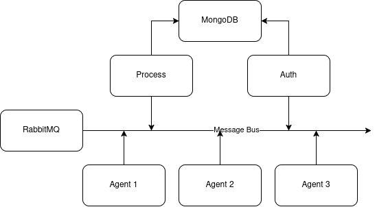

# Event Watcher

Event Watcher is a Node.js/NestJS-based backend application designed to process and monitor events in real-time. It leverages RabbitMQ for message brokering and MongoDB for persistent storage, enabling scalable and efficient event-driven workflows.

---

## Architecture Overview



- **App Instances**: Multiple instances of the Event Watcher app can run concurrently, publishing and consuming events.
- **RabbitMQ**: Acts as the message broker, decoupling producers and consumers, ensuring reliable event delivery.
- **MongoDB**: Stores processed event data for querying and analytics.

---

## Getting Started

### Prerequisites

- [Node.js](https://nodejs.org/) (v20+ recommended)
- [pnpm](https://pnpm.io/) (or npm/yarn)
- [Docker](https://www.docker.com/) & [Docker Compose](https://docs.docker.com/compose/)

### Installation

1. **Clone the repository:**

   ```bash
   git clone https://github.com/miadabdi/event-watcher.git
   cd event-watcher
   ```

2. **Configure environment variables:**
   - Copy all `.env.example` files to `.env` (for each service/app) and update values as needed:
     ```bash
     cp .env.example .env
     cp apps/auth/.env.example apps/auth/.env
     cp apps/process/.env.example apps/process/.env
     cp apps/agent/.env.example apps/agent/.env
     ```
   - Edit each `.env` to set your RabbitMQ and MongoDB connection details.

---

## Running the Application

### Using Docker Compose (Recommended)

This will start the app, RabbitMQ, and MongoDB together.

```bash
docker compose up --build
```

- The app will be available at `http://localhost:3000` for Auth, and `http://localhost:3001` for process.
- RabbitMQ management UI: `http://localhost:15672` (default user/pass: guest/guest).
- MongoDB: `mongodb://localhost:27017`

---

## Useful Commands

- **Run tests:**
  ```bash
  pnpm run test
  ```
- **Run in production:**
  ```bash
  pnpm run start:prod
  ```

---

## License

MIT
